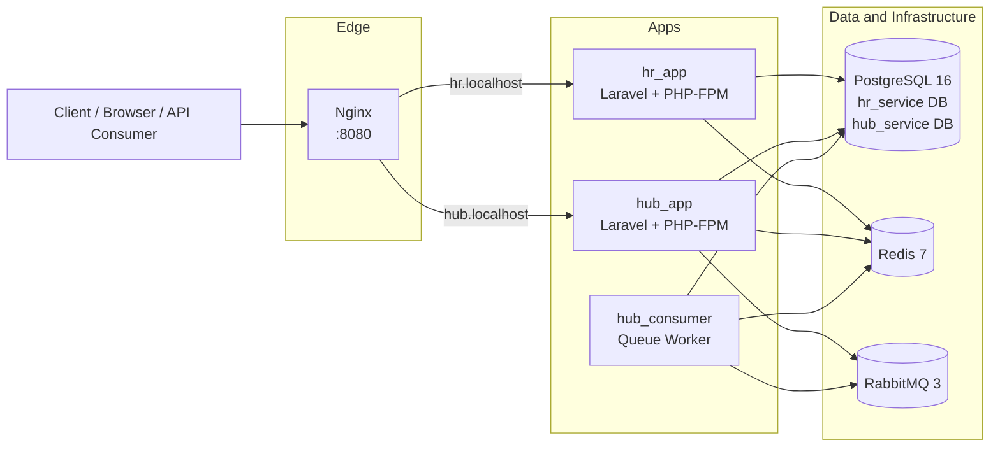

# Multi Country Platform

## Section 1: Overview

### Brief Description

Multi Country Platform is a Dockerized, microservice-style Laravel system composed of two independent domain services:

- `hr_service`: HR-focused APIs and workflows.
- `hub_service`: Hub/aggregation workflows and asynchronous processing.

Both services run behind a single Nginx entrypoint with host-based routing (`hr.localhost`, `hub.localhost`) and use shared infrastructure services for data, caching, and messaging.

### Technology Stack

- Backend framework: Laravel 12 (PHP 8.2+ compatible; runs in PHP-FPM 8.4 container image).
- API/auth: Laravel Sanctum.
- Data store: PostgreSQL 16 (separate logical databases per service).
- Cache and fast data access: Redis 7.
- Messaging/async jobs: RabbitMQ 3 with a dedicated `hub_consumer` worker.
- Web server/reverse proxy: Nginx (virtual-host routing to service containers).
- Frontend build tooling: Vite 7, Tailwind CSS 4, Axios.
- Containerization/orchestration: Docker + Docker Compose.

### Design Decisions And Trade-offs

- Domain split into `hr_service` and `hub_service`:
	- Decision: isolate business domains and deployment/runtime responsibilities.
	- Trade-off: clearer boundaries and scaling flexibility, but extra operational complexity (networking, env management, cross-service coordination).
- Shared PostgreSQL instance with separate databases:
	- Decision: one Postgres container with isolated schemas/databases per service.
	- Trade-off: simpler local setup and lower resource usage, but less fault isolation than fully separate database instances.
- RabbitMQ-backed async processing:
	- Decision: offload heavy/non-blocking tasks to queues via dedicated worker container.
	- Trade-off: improved responsiveness and resilience for API requests, but eventual consistency and queue observability become important.
- Single Nginx ingress for both services:
	- Decision: centralize HTTP entry and route by hostname.
	- Trade-off: simpler local developer UX, but ingress config is now a shared dependency.

## Section 2: Architecture

### System Architecture Diagram



### Data Flow Explanation

1. A client request reaches Nginx on port `8080`.
2. Nginx routes the request to `hr_app` or `hub_app` using hostname (`hr.localhost` or `hub.localhost`).
3. The target Laravel service executes domain logic, reads/writes its PostgreSQL database, and may use Redis for caching/session-like fast access patterns.
4. For asynchronous work, `hub_app` publishes jobs/messages to RabbitMQ.
5. `hub_consumer` pulls messages from RabbitMQ and processes background tasks, then persists outcomes to PostgreSQL and/or updates Redis.
6. The service returns a response back through Nginx to the client; async job effects are reflected in subsequent reads.

## Installation

This project runs two Laravel microservices (`hr_service` and `hub_service`) with Docker:

- `hr_app` (PHP-FPM)
- `hub_app` (PHP-FPM)
- `nginx`
- `postgres`
- `redis`
- `rabbitmq`

### Prerequisites

- Docker Desktop (or Docker Engine + Docker Compose v2)
- Hosts entries:
  - `127.0.0.1 hr.localhost`
  - `127.0.0.1 hub.localhost`

### Steps

1. From the project root, create the external Docker network (first time only):

	```bash
	docker network create mcp_network
	```

2. Ensure env files exist for both services:

	- `hr_service/.env`
	- `hub_service/.env`

3. In both env files, set database host/port to Docker PostgreSQL:

	```dotenv
	DB_CONNECTION=pgsql
	DB_HOST=postgres
	DB_PORT=5432
	DB_USERNAME=mcp_user
	DB_PASSWORD=mcp_password
	```

4. Set service-specific database names:

	- In `hr_service/.env`: `DB_DATABASE=hr_service`
	- In `hub_service/.env`: `DB_DATABASE=hub_service`

5. Build and start containers:

	```bash
	docker compose build hr_app hub_app
	docker compose up -d
	```

6. Generate app keys (one time per service):

	```bash
	docker compose exec hr_app php artisan key:generate
	docker compose exec hub_app php artisan key:generate
	```

7. Clear config cache and run migrations in both services:

	```bash
	docker compose exec hr_app php artisan config:clear
	docker compose exec hub_app php artisan config:clear
	docker compose exec hr_app php artisan migrate --force
	docker compose exec hub_app php artisan migrate --force
	```

8. Access the apps:

	- `http://hr.localhost:8080`
	- `http://hub.localhost:8080`
